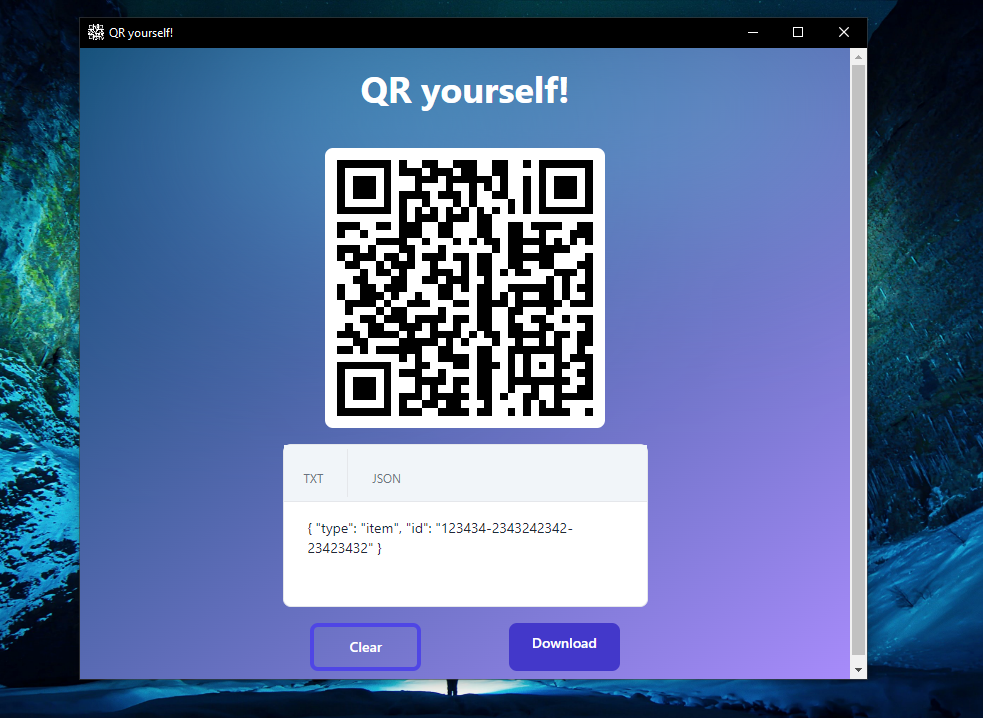

## Getting Started

<!-- ### Create an App

```
# with npx
$ npx create-nextron-app my-app --example with-typescript-tailwindcss

# with yarn
$ yarn create nextron-app my-app --example with-typescript-tailwindcss

# with pnpx
$ pnpx create-nextron-app my-app --example with-typescript-tailwindcss
``` -->

### Install Dependencies

```bash
$ cd my-app

# using yarn or npm
$ yarn (or `npm install`)
```

### Build and Use it

```bash
# development mode
$ npm run dev (or `yarn dev`)

# production build
$ npm run build (or `yarn build`)
```
